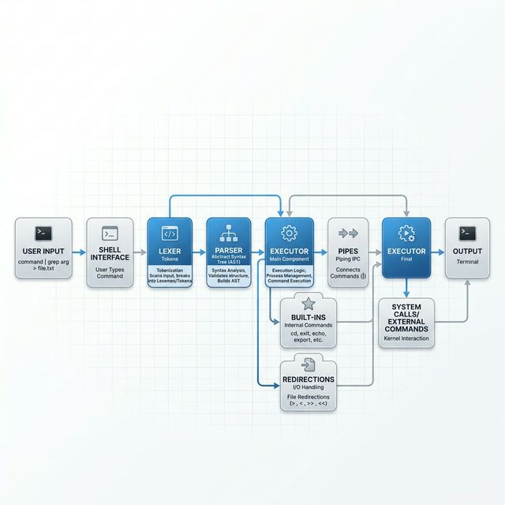

# Architecture Overview

Minishell is a simplified shell implementation that mimics the basic behavior of `bash`. This document provides a technical overview of how the shell processes a command from input to execution.

## The Lifecycle of a Command

The shell follows a standard loop: **Read -> Parse -> Execute**.

### 1. Lexical Analysis (Lexer)
The lexer (`parsing/lexer.c`) takes the raw input string and breaks it into internal tokens. It identifies:
- **Words**: Commands and arguments.
- **Operators**: Pipes (`|`), Redirections (`<`, `>`, `<<`, `>>`).
- **Quotes**: Single and double quotes are handled to preserve literal strings and manage environment variable expansion.

### 2. Parsing & Command Construction
Once tokenized, the shell builds a command structure (`parsing/cmd_construct.c`).
- It groups tokens based on pipes.
- It identifies redirections and associates them with the specific command.
- It expands environment variables (e.g., `$USER`) using the Expansion module.

### 3. Execution Engine
The execution module (`execution/execute.c`) is responsible for running the commands.
- **Built-ins**: Commands like `cd`, `echo`, and `export` are executed directly within the shell process.
- **External Commands**: For other commands, the shell forks a child process and uses `execve` to run the binary.
- **Pipelines**: Multiple commands connected by pipes are executed in parallel, with the output of one directed to the input of the next.
- **Redirections**: File descriptors are duplicated using `dup2` to redirect input and output as specified.

## Memory Management
Minishell uses a custom **Garbage Collector** (`parsing/garbage_collector.c`) to ensure clean memory management. All dynamically allocated memory is tracked and freed at appropriate points in the command lifecycle, preventing leaks.

## Signal Handling
The shell handles signals to mimic standard terminal behavior:
- `Ctrl-C`: Interrupts the current process and displays a new prompt.
- `Ctrl-D`: Sends an EOF to exit the shell.
- `Ctrl-\`: Does nothing in the main prompt but can terminate child processes.
